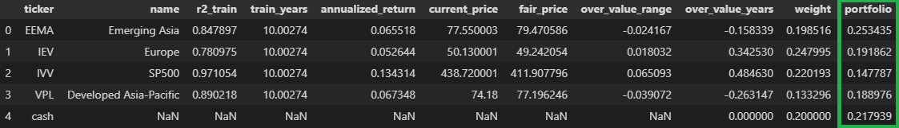

# Grandma Stock Valuation
*A simple, manageable valuation tool and portfolio builder for retail investors - even grandma can use it!*
 
* Valuate instrument with historical trend - no sophiscated technical analysis
* Build a flexible portfolio with your personal interest
* Invest at your own pace - you can even trade only once per month/quarter
* Back your investment decision with firm numbers - no more frustration from all the media noise!

 

Please kindly star:star: if you found the project interest:blush:

 

* [Introduction](#introduction)
    * [Grandma Stock Valuation Model](#grandma-stock-valuation-model)
    * [Grandma Portfolio Allocation](#grandma-portfolio-allocation)
    * [Yahoo Data Loader](#yahoo-data-loader)
* [A Quick Glance](#a-quick-glance)
    * [Valuation of SP500](#valuation-of-sp500)
    * [Portfolio Allocation](#portfolio-allocation)
    * [Back Test](#back-test)
* [Documentation and Examples](#documentation-and-examples)
* [Installation](#installation)

 

## Introduction

### Grandma Stock Valuation Model

"Grandma-style" traders look at only the historical daily prices - buy when the price is low - sell when the price is high.

The **Grandma Stock Valuation (GSV)** model automated this simple idea, with a number of enhancements:
* Derive price trend based on historical daily price
* Identify extreme historical periods as outliers
* Evaluate *fair price*, *over-valued %*, and *over-valued years*

Note that the model is most suitable for **broad ETF** (country / region level ETF), such as S&P 500.

 

### Grandma Portfolio Allocation

Give a group of your interested stocks, the **Grandma Portfolio Allocation (GPA)** suggests how much % of your budget to be allocated to each stock. 
It allocates larger proportion to more under-valued stocks, with additional capabilities:
* Sensitivity to over/under valuation
* Weight by both correlation and valuation
* Compensation to the number of instruments
* Include cash as part of the portfolio, in order to realize profit

Please note that
* The portfolio allocator only works with **instruments with sufficient positive return** (suggest > 1% historical annualized return).
* The portfolio allocator does not take **exchange rate** into consideration. If needed, you will need to adjust the data by yourself.

 

### Yahoo Data Loader

The package also includes a data loader to query daily data from Yahoo Finance - for free.

 

## A Quick Glance

### Valuation of SP500

Figure below illustrates the **Grandma Stock Valuation** model with default settings:
* It shows the result of 10-year (2012-03-01 to 2022-02-28) adjusted close-price of iShares Core S&P 500 ETF (IVV).
* The figure was generated using the `plotTrendline()` function.

Valuation is evaluated by the current price, the trend, and the historical growth. 
The `evaluateValuation()` function summarized valuation metrics including:
* annualized growth: 13.4 %
* over-valued range: 6.5 %
* over-valued years: 0.48 years

 

### Portfolio Allocation

Based on the valuation, **Grandma Portfolio Allocation** can suggest how much % of your budget to allocate to each stock in your portfolio.

Here I use a portfolio with 4 ETFs + Cash as an example. Below is the result of the suggested allocation in this portfolio, generated by `allocatePortfolio()` function:

* The allocation is determined by a combination of valuation and the correlation weight.
    * Higher allocation to stocks more under-valued, or less correlated with others stocks.
    * Using correlation weight is optional. It can be calcuated by the `getCorrelationWeight()` function.
* The `addCashPortfolio()` function can add cash as part of your portfolio.
    * It is optional to have cash in your portfolio. It is suggested as a mechanism to realize your profit.

 

### Back Test

Many people ask me "What is the back-test performance?"

Well, this is a tool for you to valuate stocks and build your own portfolio -- I'm not selling you to invest in a fund.

The package will include the back-test functionality in the next version. 
Still, please note that:
* Back-test is for understanding how a strategy behaves under different scenaros.
* Good back-test results cannot prove future performance.
    * This tool gives you a lot of flexibility in configuration. You may find a set of stocks and model parameters which yields exceptional back-test result - but may not be that good in future.
* In general, investment products are not designed to get exceptional returns, but to fulfill the need of a group of investors.
    * If you hold medium to long investment horizon, if you want to have firm quantitative basis for your decisions - this tool is for you.

 

## Documentation and Examples

Please refer to https://github.com/gowestyang/grandma-stock-valuation/tree/main/doc for detailed documentations and examples:
* Step-by-step guide to use the package, with python scripts and package data.
    * Query data from Yahoo Finance
    * Valuate stocks with Grandma Stock Valuation model, and visualize the result
    * Construct a portfolio with Grandma Portfolio Allocation
    * Back-test (WIP)
* Detailed explaination to the parameters, math and design considerations.

 

## Installation
### Dependencies
grandma-stock-valuation requires
* Python (>=3.7)
* NumPy
* pandas
* scikit-learn
* Plotly
* kaleido

 

### User Installation
If you already have the dependencies installed, you can install grandma-stock-valuation using `pip`:

    pip install -U grandma-stock-valuation
