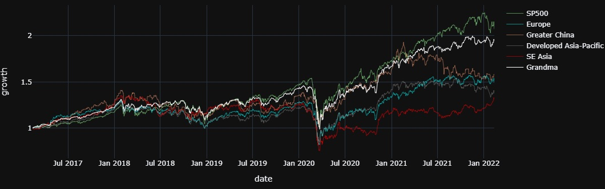

# Grandma Stock Valuation (GSV)
*A simple, manageable valuation tool and portfolio builder for retail investors - even grandma can use it!*
 
* Valuate instrument with historical trends - no sophiscated technical analysis
* Build a flexible portfolio with your personal interest
* Trade at your own pace - you can even trade only once per month/quarter
* Back your investment decision with firm numbers - no more frustration from all the media noise!

 

Please kindly star:star: if you found the project interest:blush:

 

* [Introduction](#introduction)
* [Examples](#examples)
    * [Valuation of an Instrument](#valuation-of-an-instrument)
    * [Portfolio Allocation of a Group of Instruments](#portfolio-allocation-of-a-group-of-instruments)
    * [Backtest Result](#backtest-result)
    * [Python Scripts](#python-scripts)
* [Documentation](#documentation)
* [Installation](#installation)

 

## Introduction
"Grandma-style" traders look at only the historical daily prices - buy when the price is low - sell when the price is high.

 

The **Grandma Stock Valuation** model enhanced this simple idea with a number of qualitative considerations:
* Type of curves to fit on historical daily prices
* Outliers identification
* Evaluate *fair price*, *over-valued %*, and *over-valued years*

In addition, the project includes a **portfolio allocator**, which suggests the portfolio allocation of your selected group of instruments. 
It allocates larger proportion to more under-valued instruments, with several configurations:
* Sensitivity to over/under valuation
* Compensation to the number of instruments
* Option to include cash as part of the portfolio, in order to realize profit

 

Important Notes
* The valuation model is most suitable for **broad ETF**, such as S&P 500 ETF.
* The portfolio allocator only works with **instruments with sufficient positive return** (suggest > 1% historical annualized return).

 

## Examples

 

### Valuation of an Instrument
Figure below illustrates the **GSV model** with default settings.
* It shows the result of 10-year (2012-02-13 to 2022-02-11) adjusted close-price of iShares Core S&P 500 ETF (IVV).
* The figure was generated using the `plotTrendline()` function.

 

The following valuation metrics were summarized by the `evaluateValuation()` function:
* annualized return: 13.41 %
* over-valued range: 8.16 %
* over-valued years: 0.61

The valuation metrics showed that this SP500 ETF was over-valued by 8.16% , While considering its high historical growth, it was over-valued by 0.61 years.

 

### Portfolio Allocation of a Group of Instruments

Table below illustrates the **Portfolio Allocator** with default settings.

This portfolio selected 5 instruments to provide a near-global coverage:
* iShares Core S&P 500 ETF (IVV)
* iShares Europe ETF (IEV)
* SPDR FTSE Greater China ETF (3073.HK)
* Vanguard FTSE Pacific Fund ETF (VPL)
* Global X FTSE Southeast Asia ETF (ASEA)

Each instrument was valuated over the same period as described in the SP500 example above, using the same method.

The `portfolio_allocation` column showed that 3073.HK and VPL were suggested to be allocated heavily, because they were under-valued. 
The SP500 ETF (IVV), though over-valued, still deserved some allocation in this portfolio.

 

### Backtest Result

Figure below is the 5-year backtest result, with default settings, and portfolio rebalanced monthly.

This sample portfolio achieved growth close to SP500, with a global diversification. 
The allocation on average was SP500 (40%), SE Asia (18%), Europe (16%), Developed Asia-Pacific (14%), Greater China (11%).

 

### Python Scripts
Refer to `example_valuation_and_portfolio_allocation.ipynb` under `doc` folder for sample scripts to
* Load data from Yahoo finance
* Valuate the instruments with GSV model
* Visualize the result
* Construct a portfolio

 

## Documentation
Refer to the `doc` folder for additional documentation.

 

## Installation
### Dependencies
grandma-stock-valuation requires
* Python (>=3.7)
* NumPy
* pandas
* scikit-learn
* Plotly
* kaleido

 

### User Installation
If you already have the dependencies installed, you can install grandma-stock-valuation using `pip`:

    pip install -U grandma-stock-valuation
